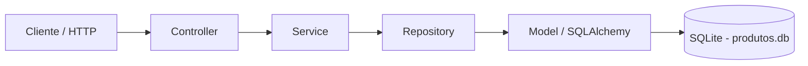

# API de Produtos — Desafio Final (Arquiteto(a) de Software)

API REST em Python usando FastAPI, desenvolvida no padrão arquitetural MVC em camadas, com persistência em SQLite via SQLAlchemy. A aplicação expõe um CRUD completo para o domínio Produto, além de endpoints para listagem, busca por nome, contagem e atualização de registros.

## 1. Contexto do desafio

Este projeto foi desenvolvido como solução para o desafio final do bootcamp de Arquiteto(a) de Software. O objetivo principal é demonstrar a criação de uma API REST pública, com organização em camadas, seguindo boas práticas de arquitetura e separação de responsabilidades.

O domínio escolhido foi Produto, por ser simples, objetivo e adequado para representar operações CRUD e regras de negócio em uma API.

## 2. Objetivos alcançados

- Implementar uma API RESTful em Python com FastAPI
- Seguir a arquitetura MVC em camadas
- Criar operações de CRUD para produtos
- Incluir endpoints de contagem e busca por nome
- Persistir os dados em SQLite
- Documentar a aplicação e a estrutura do projeto

## 3. Arquitetura da solução

A aplicação foi organizada em camadas, separando responsabilidades entre apresentação, regras de negócio, acesso a dados e persistência.



### Visão arquitetural

- Cliente faz requisições HTTP para os endpoints da API
- O Controller recebe e encaminha a requisição
- O Service executa a lógica de negócio
- O Repository centraliza as operações de persistência
- O Model representa a entidade Produto no banco
- O SQLite armazena os dados localmente

### Diagramas arquiteturais

- [C4 — Nível 1: Contexto](docs/c4_nivel1_contexto.png)
- [C4 — Nível 2: Contêineres](docs/c4_nivel2_container.png)
- [C4 — Nível 3: Componentes](docs/c4_nivel3_componentes.png)

## 4. Tecnologias utilizadas

- Python 3.12+
- FastAPI
- SQLAlchemy
- SQLite
- Pydantic
- Uvicorn

## 5. Estrutura de pastas

```text
Projeto-api/
├── app/
│   ├── __init__.py
│   ├── main.py                    # Ponto de entrada da aplicação
│   ├── database.py                # Configuração do banco SQLite e sessão
│   ├── controllers/
│   │   └── produto_controller.py  # Endpoints HTTP da API
│   ├── models/
│   │   └── produto_model.py       # Entidade Produto (ORM)
│   ├── repositories/
│   │   └── produto_repository.py  # Acesso ao banco e queries
│   ├── schemas/
│   │   └── produto_schema.py      # DTOs e validação com Pydantic
│   └── services/
│       └── produto_service.py     # Regras de negócio do domínio
├── .gitignore                     # Arquivos ignorados pelo Git
├── requirements.txt               # Dependências do projeto
├── README.md                      # Documentação do projeto
├── produtos.db                    # Banco SQLite gerado automaticamente
└── .venv/                         # Ambiente virtual do projeto
```

### Papel de cada componente

- Controller: recebe as requisições HTTP e delega o processamento ao Service
- Service: encapsula a lógica de negócio e orquestra a aplicação
- Repository: realiza a persistência e consultas no banco de dados
- Model: representa a entidade Produto e o mapeamento ORM para o SQLite
- Schema: define os formatos de entrada e saída da API com validação
- Database: centraliza a configuração da conexão e a sessão do banco

## 6. Endpoints da API

| Método | Rota | Descrição |
|--------|------|-----------|
| POST | `/produtos` | Cria um novo produto |
| GET | `/produtos` | Lista todos os produtos |
| GET | `/produtos/{id}` | Busca produto por ID |
| GET | `/produtos/nome/{nome}` | Busca produtos por nome |
| GET | `/produtos/contar` | Retorna o total de produtos |
| PUT | `/produtos/{id}` | Atualiza um produto existente |
| DELETE | `/produtos/{id}` | Remove um produto |

### Exemplo de payload para criação

```json
{
  "nome": "Teclado Mecânico",
  "descricao": "Teclado com switches azuis",
  "preco": 299.90,
  "estoque": 15
}
```

## 7. Como executar o projeto

### 1) Criar o ambiente virtual

No Windows:

```powershell
python -m venv .venv
.\.venv\Scripts\Activate.ps1
```

No Linux/macOS:

```bash
python -m venv .venv
source .venv/bin/activate
```

### 2) Instalar dependências

```bash
pip install -r requirements.txt
```

### 3) Rodar a aplicação

```bash
python -m uvicorn app.main:app --reload
```

A API será iniciada em:

- http://127.0.0.1:8000
- Documentação Swagger: http://127.0.0.1:8000/docs

## 8. Persistência de dados

O banco SQLite é configurado no arquivo [app/database.py](app/database.py) com a URL:

```python
DATABASE_URL = "sqlite:///./produtos.db"
```

O arquivo `produtos.db` é gerado automaticamente ao iniciar a aplicação, caso ainda não exista. Isso torna a solução simples de rodar e de testar localmente.

## 9. Observações finais

Este projeto atende aos requisitos principais do desafio:

- API REST com CRUD
- Arquitetura em camadas com MVC
- Persistência em banco de dados
- Separação de responsabilidades
- Documentação inicial do sistema

Para uma entrega mais completa de um bootcamp, recomenda-se, como continuidade, incluir:

- diagrama UML/C4 no repositório
- documentação arquitetural mais detalhada
- testes automatizados
- possibilidade de expansão para outros domínios (cliente, pedido, etc.)

## 10. Conclusão

A solução implementada demonstra uma API funcional, bem estruturada e alinhada ao contexto do desafio final. O projeto cumpre o objetivo de disponibilizar operações de gestão de produtos em uma arquitetura organizada e de fácil manutenção.


