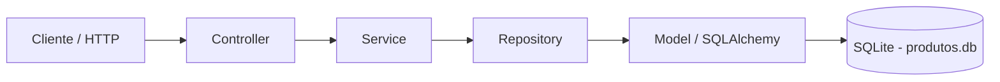

# API de Produtos - Desafio Final (Arquiteto(a) de Software)

API REST local em Python usando FastAPI, organizada em camadas inspiradas no padrão MVC, com persistência em SQLite via SQLAlchemy. A aplicação oferece CRUD completo para produtos, busca por nome, busca por ID e contagem de registros.

## 1. Contexto do desafio

Este projeto foi desenvolvido como solução para o desafio final do bootcamp de Arquiteto(a) de Software. O objetivo é demonstrar uma API REST organizada em camadas, com separação de responsabilidades e persistência de dados.

O domínio escolhido foi Produto, por ser adequado para representar operações CRUD e regras de validação em uma API.

## 2. Objetivos alcançados

- Implementar uma API RESTful em Python com FastAPI
- Organizar a aplicação em camadas de Controller, Service, Repository, Model e Schema
- Criar operações de CRUD para produtos
- Incluir busca por ID, busca por nome e contagem
- Persistir os dados em SQLite
- Documentar a API com Swagger/OpenAPI
- Criar testes unitários e integrados

## 3. Arquitetura da solução

A aplicação separa as responsabilidades entre entrada HTTP, orquestração, acesso a dados e persistência.



### Visão arquitetural

- O cliente faz requisições HTTP para os endpoints da API
- O Controller recebe a requisição e delega o processamento
- O Service orquestra o fluxo da aplicação
- O Repository centraliza as consultas e operações de persistência
- O Model representa a entidade Produto no banco
- O Schema define e valida os dados de entrada e saída

### Diagramas C4

- [C4 - Nível 1: Contexto](docs/c4_nivel1_contexto.png)
- [C4 - Nível 2: Contêineres](docs/c4_nivel2_container.png)
- [C4 - Nível 3: Componentes](docs/c4_nivel3_componentes.png)

## 4. Tecnologias utilizadas

- Python 3.12+
- FastAPI
- SQLAlchemy
- SQLite
- Pydantic
- Uvicorn
- httpx2, usado pelo TestClient nos testes

## 5. Estrutura de pastas

```text
Projeto-api/
├── app/
│   ├── __init__.py
│   ├── main.py                    # Ponto de entrada da aplicação
│   ├── database.py                # Configuração do banco e sessão
│   ├── controllers/
│   │   └── produto_controller.py  # Endpoints HTTP
│   ├── models/
│   │   └── produto_model.py       # Entidade Produto (ORM)
│   ├── repositories/
│   │   └── produto_repository.py  # Consultas e persistência
│   ├── schemas/
│   │   └── produto_schema.py      # Validação dos dados
│   └── services/
│       └── produto_service.py     # Orquestração da aplicação
├── docs/                          # Diagramas arquiteturais C4
├── tests/                         # Testes unitários e integrados
│   ├── __init__.py
│   ├── test_produto_service.py
│   └── test_produto_integracao.py
├── .gitignore
├── requirements.txt
├── README.md
├── produtos.db                    # Banco local gerado automaticamente
└── .venv/                         # Ambiente virtual local
```

## 6. Endpoints da API

| Método | Rota | Descrição |
|--------|------|-----------|
| POST | `/produtos` | Cria um novo produto |
| GET | `/produtos` | Lista todos os produtos |
| GET | `/produtos/{id}` | Busca um produto por ID |
| GET | `/produtos/nome/{nome}` | Busca produtos por nome |
| GET | `/produtos/contar` | Retorna o total de produtos |
| PUT | `/produtos/{id}` | Atualiza um produto existente |
| DELETE | `/produtos/{id}` | Remove um produto |

### Exemplo de payload para criação

```json
{
  "nome": "Teclado Mecânico",
  "descricao": "Teclado com switches azuis",
  "preco": 299.90,
  "estoque": 15
}
```

Use ponto no valor decimal do JSON, como `299.90`, e não vírgula.

## 7. Como executar o projeto

### 1) Criar o ambiente virtual

No Windows:

```powershell
python -m venv .venv
.\.venv\Scripts\Activate.ps1
```

No Linux/macOS:

```bash
python -m venv .venv
source .venv/bin/activate
```

### 2) Instalar dependências

```bash
pip install -r requirements.txt
```

### 3) Executar a aplicação

```bash
python -m uvicorn app.main:app --reload
```

A API ficará disponível em:

- http://127.0.0.1:8000
- Swagger: http://127.0.0.1:8000/docs

## 8. Persistência de dados

O SQLite é configurado em [app/database.py](app/database.py). O caminho do banco é calculado a partir da localização do projeto, garantindo que a aplicação use sempre `produtos.db` na raiz do repositório, independentemente da pasta de onde o comando é executado.

O arquivo é criado automaticamente ao iniciar a aplicação, caso ainda não exista.

## 9. Testes

Os testes unitários validam o Service com mocks e as regras de validação dos Schemas. Os testes integrados percorrem o fluxo completo:

`Endpoint -> Controller -> Service -> Repository -> SQLite`

Os testes integrados usam um SQLite temporário em memória e não alteram o banco real `produtos.db`.

Para executar todos os testes:

```powershell
.\.venv\Scripts\python.exe -m unittest discover -s tests -p "test_*.py" -v
```

A suíte atual possui 11 testes.

## 10. Conclusão

A solução demonstra uma API funcional, documentada e organizada em camadas, com persistência em banco de dados, validação de dados e testes automatizados. A estrutura permite a expansão futura para outros domínios, como clientes e pedidos.
